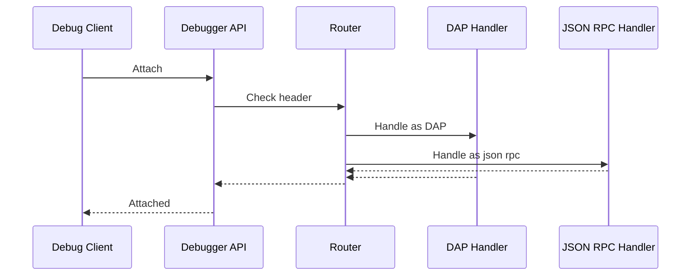
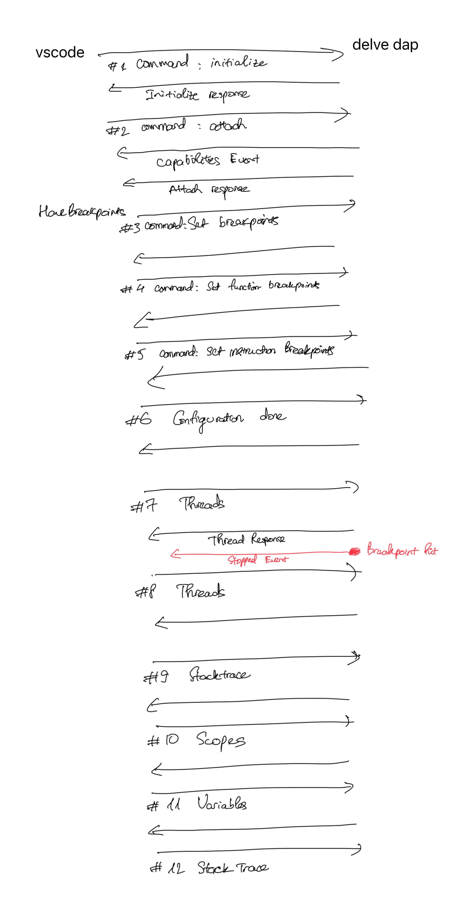

<a href="https://marketplace.visualstudio.com/items?itemName=phuongdnguyen.temporal-workflow-debugger"></a>
[](https://pkg.go.dev/github.com/phuongdnguyen/temporal-workflow-debugger/replayer-adapter-go)
[](https://badge.fury.io/py/temporal-replayer-adapter-python)
[](https://badge.fury.io/js/@phuongdnguyen%2Freplayer-adapter-nodejs)

## Introduction
TLDR: watch the [demo](https://www.youtube.com/watch?v=8XKKz0iotow&t=50s).

A comprehensive debugging solution that enables step-through debugging of [Temporal](https://github.com/temporalio/temporal) workflows. Unlike traditional debuggers that aren't aware of Temporal's execution model, this debugger provides a seamless development experience by allowing you to set breakpoints, inspect variables, and trace execution flow within your workflow code.

## Why This Debugger?

Debugging Temporal workflows has traditionally been challenging. Execution of a workflow is driven by history events rather than direct code execution. Workflow state is managed externally by the Temporal service, and the progress of a workflow depends on interaction between the Temporal server and a thick SDK that knows how to use history events to trigger the actual workflow code execution.

This debugger solves these challenges by leveraging the **workflow replayer** - it reconstructs workflow execution from Temporal's event history, allowing you to debug exactly what happened during the original execution.

## Key Features

- **Multi-language Support**: Works with Go, TypeScript/Node.js, and Python via adapters
- **VS Code Extension**: Open a panel, load history, set event breakpoints, and replay with your adapter
- **History Event-based Breakpoints**: Set breakpoints on specific workflow history events

## Installation

### Prerequisites

1. **Install tdlv debugger** from [GitHub Release](https://github.com/phuongdnguyen/temporal-workflow-debugger/releases/tag/tdlv-v0.0.2)

   Verify installation:
   ```bash
   tdlv --help
   ```

2. **Install language-specific dependencies**:

   **Python**
   ```bash
   tdlv --lang=python --install
   ```

   **JavaScript/TypeScript**
   ```bash
   tdlv --lang=js --install
   ```

   **Go**
   ```bash
   tdlv --lang=go --install
   ```

### IDE Plugins

**VS Code** : 
<a href="https://marketplace.visualstudio.com/items?itemName=phuongdnguyen.temporal-workflow-debugger"></a>

### Replayers

**Use language-specific replayers to debug your workflows:**
- **Go**: [github.com/phuongdnguyen/temporal-workflow-debugger/replayer-adapter-go](https://pkg.go.dev/github.com/phuongdnguyen/temporal-workflow-debugger/replayer-adapter-go) [](https://pkg.go.dev/github.com/phuongdnguyen/temporal-workflow-debugger/replayer-adapter-go)
- **Python**: [temporal-replayer-adapter-python](https://pypi.org/project/temporal-replayer-adapter-python/) [](https://badge.fury.io/py/temporal-replayer-adapter-python)
- **TypeScript**: [@phuongdnguyen/replayer-adapter-nodejs](https://www.npmjs.com/package/@phuongdnguyen/replayer-adapter-nodejs) [](https://badge.fury.io/js/@phuongdnguyen%2Freplayer-adapter-nodejs)

## Usage

### VS Code

#### Quick Start

1. **Install Extension**: Install from VS Code Marketplace
2. **Follow Language Examples**:
   - [TypeScript](./example/js/vscode-replayer.ts)
   - [Go](./example/go/structured-workflow/replay-debug-ide-integrated/)
   - [Python](./example/python/vscode-replay.py)
3. **Open Panel**: Run `Temporal: Open Panel` (Cmd/Ctrl-Shift-P)
4. **Load History**: Enter Workflow ID or choose history JSON file
5. **Set Breakpoints**: Select history events to stop on
6. **Debug**: Start replaying - execution pauses at breakpoints

#### Server Configuration

Default connection: `localhost:7233`

To connect to different servers:
- Open `SETTINGS` tab
- Edit `Address` field
- For TLS (Temporal Cloud): check box and select client cert/key

### Debug setup
Tested language version
- Go 1.19+.
- NodeJS v22.17.0, Npm 10.9.2
- Python 3.12.11


#### TypeScript

Create a small `replayer.ts` in your project that runs the Tyepscript replayer adapter in IDE mode and registers your workflow function, for example:

1. Install the replayer first:

```
npm i @phuongdnguyen/replayer-adapter-nodejs --save
```

2. Install the debugger [tdlv](https://github.com/phuongdnguyen/temporal-workflow-debugger/releases/tag/tdlv-v0.0.2) and add it to PATH
3. Verify tldv is installed in PATH

```
tdlv --help
Missing required flags: -lang

Tdlv (Temporal delve) is a temporal workflow debugger

Usage: tdlv [options]

  -help
        Tdlv (Temporal delve) is a temporal workflow debugger, provide ability to focus on user workflow code in debug sessions (alias: -h)
  -install
        auto-install missing language debuggers
  -lang string
        [required] language to use for the workflow, available options: [go, python, js]
  -p int
        port for remote debugging (default 60000)
  -start
        start debugger
```

4. Your entrypoint file should import the replayer adapter and your workflow:

```typescript
import { exampleWorkflow } from "./workflow"
import { ReplayMode, replay } from "@phuongdnguyen/replayer-adapter-nodejs"

async function main() {
  const opts = {
    mode: ReplayMode.IDE,
    workerReplayOptions: {
      workflowsPath: require.resolve("./workflow.ts"),
    },
  }

  await replay(opts, exampleWorkflow)
}

if (require.main === module) {
  main().catch((error) => {
    console.error("Error:", error)
    process.exit(1)
  })
}
```

5. Open or create `.vscode/settings.json` and add the config field:

```json
{
  "temporal.replayerEntryPoint": "replayer.ts"
}
```

_Note that the file must be within your project directory so it can find `node_modules/`._

#### Go

1. Get the replayer code

```
go get -u github.com/phuongdnguyen/temporal-workflow-debugger/replayer-adapter-go@latest
```

2. Create a small `main.go` in your project that runs the Go replayer adapter in IDE mode and registers your workflow function, for example:

```go
package main

import (
    "go.temporal.io/sdk/worker"
    replayer_adapter_go "github.com/phuongdnguyen/temporal-workflow-debugger/replayer-adapter-go"
    "example/pkg/workflows"
)

func main() {
    replayer_adapter_go.SetReplayMode(replayer_adapter_go.ReplayModeIde)
    err := replayer_adapter_go.Replay(replayer_adapter_go.ReplayOptions{
        WorkerReplayOptions: worker.WorkflowReplayerOptions{DisableDeadlockDetection: true},
    }, workflows.ExampleWorkflow)
    if err != nil {
        panic(err)
    }
}
```

3. Configure the extension:

```json
{
  "temporal.debugLanguage": "go",
  "temporal.replayerEntrypoint": "main.go"
}
```

4. Run "Temporal: Open Panel"
5. Enter a Workflow Id or choose a history JSON file
6. Click `Load History`
7. Select history events that you want the workflow to be stopped on
8. Hit `Start debug session`

#### Python

1. Make sure your Python environment has the required dependencies installed:

```bash
pip install temporalio replayer-adapter-python
```

2. Create a small script (e.g. `replayer.py`) that uses the Python replayer adapter in IDE mode and references your workflow:

```python
import asyncio
from replayer_adapter_python.replayer import (
    ReplayMode, ReplayOptions, set_replay_mode, replay
)
from workflow import UserOnboardingWorkflow

async def main():
    """Run ide examples"""
    try:
        # Set up ide mode
        set_replay_mode(ReplayMode.IDE)

        # Create replay options
        opts = ReplayOptions(
            worker_replay_options={},
        )
        result = await replay(opts, UserOnboardingWorkflow)
        print(f"Result: {result}")
    except Exception as e:
        print(f"Replay failed: {e}")

if __name__ == "__main__":
    asyncio.run(main())
```

3. Configure the extension:

```json
{
  "temporal.debugLanguage": "python",
  "temporal.replayerEntryPoint": "replayer.py"
  // If you want use a custom python rather the one in PATH
  // "temporal.python": "/Your/path/to/python"
}
```

4. Run "Temporal: Open Panel"
5. Enter a Workflow Id or choose a history JSON file
6. Click `Load History`
7. Select history events that you want the workflow to be stopped on
8. Hit `Start debug session`


## Architecture

### Overview

The plugin consists of an IDE Debugging UI, service layer, and debugger (`tdlv`) for debugging Temporal workflows.

### Components

- **IDE Debugging UI**: Panel for history upload and set breakpoints.
- **IDE Debugging Service**: Provide API for the Debugger to retrieve the uploaded history & breakpoints.
- **Debugger (`tdlv`)**: Communicates with language debugger (think Delve, Js-Debug, Debugpy) to intercept debugging event. If a breakpoint is hit, the Debugger notifies the IDE Debugging Service to highlight the event that has its breakpoint hit.
- **Adapter**: Adapter places sentinel breakpoints inside Temporal workflow/activity interceptors.

### Architecture Diagram

```
┌─────────────────┐    ┌──────────────────┐    ┌─────────────────┐
│   IDE Plugin    │    │   Serving Layer  │    │ Debugger Server │
│                 │◄──►│   (tdlv)         │◄──►│   + Workflow    │
│                 │    │                  │    │   Replayer      │
└─────────────────┘    └──────────────────┘    └─────────────────┘
        │                       │                       │
        │              ┌────────▼────────┐              │
        │              │IDE Plugin Server│              │
        │              │ (Breakpoints +  │              │
        └─────────────►│  History)       │◄─────────────┘
                       └─────────────────┘
```

The debugger consists of several integrated components:

1. **IDE Plugin**: Provides the user interface, manages workflow history, and integrates with IDE debugging
2. **Serving layer (`tdlv`)**: Intercepts debugging commands and enhances them with workflow-specific logic
3. **Workflow Replayer**: Executes workflow code deterministically using Temporal's replayer
4. **History Server**: Manages workflow event history and breakpoint state
5. **Replayer Adapter Layer**: Connects the replay execution with the debugging infrastructure

### Debug Flow

1. User upload history JSON.
2. User set event breakpoints.
3. User start debugging session.
4. Plugin launches `tdlv` process.

### Design Decisions

Some notable design decisions are:
- Place sentinel breakpoints in workflow & activity interceptors
- Intercept DAP stream to hide workflow & adapter code
- For go delve-json rpc integration (used in Goland), re-use some of the logic in Delve to differentiate JSON-RPC and DAP based on the first byte.



## How it works

The debugger leverages Temporal's workflow replayer functionality to reconstruct execution from event history. When you debug a workflow:

1. The replayer processes the workflow's event history deterministically
2. Sentinel breakpoints are placed in workflow/activity interceptors via language-specific adapters
3. The `tdlv` serving layer intercepts debugging commands and coordinates with your IDE
4. When execution hits a breakpoint, the debugger pauses and allows inspection of the workflow state at that specific point in history

This approach provides accurate debugging of the exact execution that occurred, rather than a new execution that might behave differently.




## Development Setup

### Prerequisites

- Clone repository
- Build tdlv: `go build` in tdlv/
- Build VS Code extension: see [vscode extension readme](./vscode-debugger-extension/README.md)

### Project Structure

- **tdlv/**: Intercept message from language debugger
- **jetbrains-plugin/**: JetBrains Plugin (support Go)
- **vscode-debugger-extension**: VS Code Extension (support Go, Python, Js/TS)
- **replayer-adapter-go/**: Inject sentinel breakpoints for Temporal Go SDK
- **replayer-adapter-python/**: Inject sentinel breakpoints for Temporal Python SDK
- **replayer-adapter-nodejs/**: Inject sentinel breakpoints for Temporal TypeScript SDK
- **example/**: Test workflows

## Contributing

This project welcomes contributions. To contribute:

- Fork and branch from main
- Add tests for new functionality
- Update documentation as needed
- Submit PR with clear description of changes

Please see the individual component READMEs and documentation for development guidelines.

## License

[Apache 2.0](./LICENSE)

