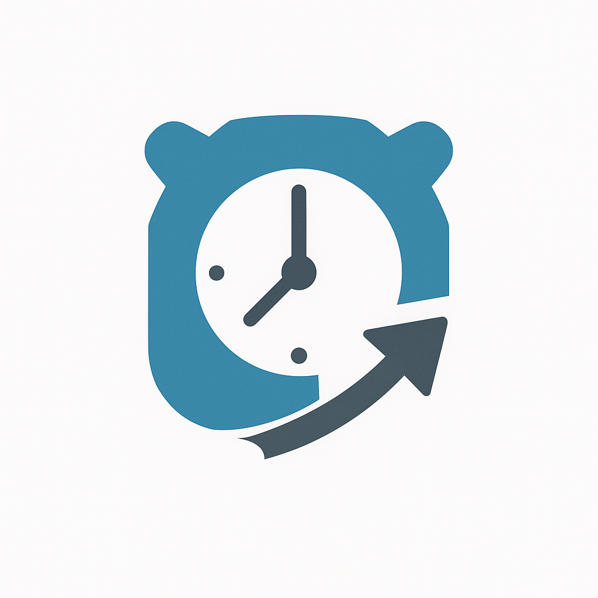

# Debugger for Temporal Workflows

# Introduction

A comprehensive debugging solution that enables step-through debugging of [Temporal](https://github.com/temporalio/temporal) workflows. Unlike traditional debuggers that are not aware of the execution model of Temporal, this debugger provides a seamless development experience by allowing you to set breakpoints, inspect variables, and trace execution flow within your workflow code.

## Why?

Debugging Temporal workflows has traditionally been challenging. Execution of a workflow is driven by history events rather than direct code execution. Workflow state is managed externally by the Temporal service, the progress of a workflow depends on interaction between Temporal server and a thick SDK that know how to use history event to trigger the actual workflow code execution. 

This debugger solves these challenges by leveraging the **workflow replayer** - it reconstructs workflow execution from Temporal's event history, allowing you to debug exactly what happened during the original execution.

## Key Features

### **Seamless IDE Integration**
- **Support multiple languages**: Provide the ability to debug in multiple SDK languages (there are Go, TypeScript & Python example provided, support for other languages it's coming when I have the bandwidth to implement it)
- **JetBrains Plugin**: Native integration with Goland via a debugging plugin, use standard IDE debugging controls (breakpoints, step-over, step-into, variable inspection) or set breakpoint in workflow history

## Who Is This For?

- **Temporal Workflow Developers**: Anyone building workflows with Temporal's SDK

Whether you're debugging a complex workflow that's failing in production or just want a better development experience while building new workflows, this debugger provides the tools you need to understand and fix your Temporal workflow code efficiently.

## Usage
You can run the debugger in:
- Standalone mode: run the debugger with your workflow code and connect your IDE to it. This approach is lower-level and not recommended for end user. To install the debugger, download it from the [Github Release Page](https://github.com/phuongdnguyen/temporal-workflow-debugger/releases)

- IDE Integrated (only available for Go users on Goland): install the plugin and debug your workflow via a debugging UI. This approach provides a more complete debugging experience and is the recommended approach.

Install the plugin from:
- [Jetbrains marketplace](https://plugins.jetbrains.com/plugin/28127-temporal-workflow-debugger)

- [Vscode marketplace](https://marketplace.visualstudio.com/items?itemName=phuongdnguyen.temporal-workflow-debugger&ssr=false#overview)

- Replayer for Temporal SDK languages:
    - [Go](https://pkg.go.dev/github.com/phuongdnguyen/temporal-workflow-debugger/replayer-adapter-go)
    - [Python](https://pypi.org/project/temporal-replayer-adapter-python/)
    - [TS](https://www.npmjs.com/package/@phuongdnguyen/replayer-adapter-nodejs)

