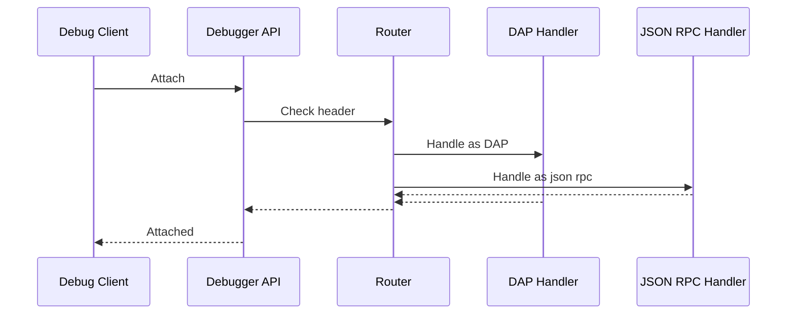

# Architecture

## Overview

The plugin consists of a JetBrains UI, service layer, and tdlv integration for debugging Temporal workflows.

## Components

- UI: WorkflowDebuggerPanel for history upload and breakpoints.
- Service: WfDebuggerService manages state and history server.
- Debug: WfDebugRunState launches tdlv and connects GoLand debugger.
- Adapter: replayer-adapter integrates with Temporal for replay debugging.

## Flow

1. Upload history JSON.
2. Set event breakpoints.
3. Run launches tdlv process.
4. Auto-connects Go Remote debug configuration.

## Design

- Uses HTTP server for history data.
- Temporary Go Remote config for connection.
- State persisted in WfDebuggerState. 

