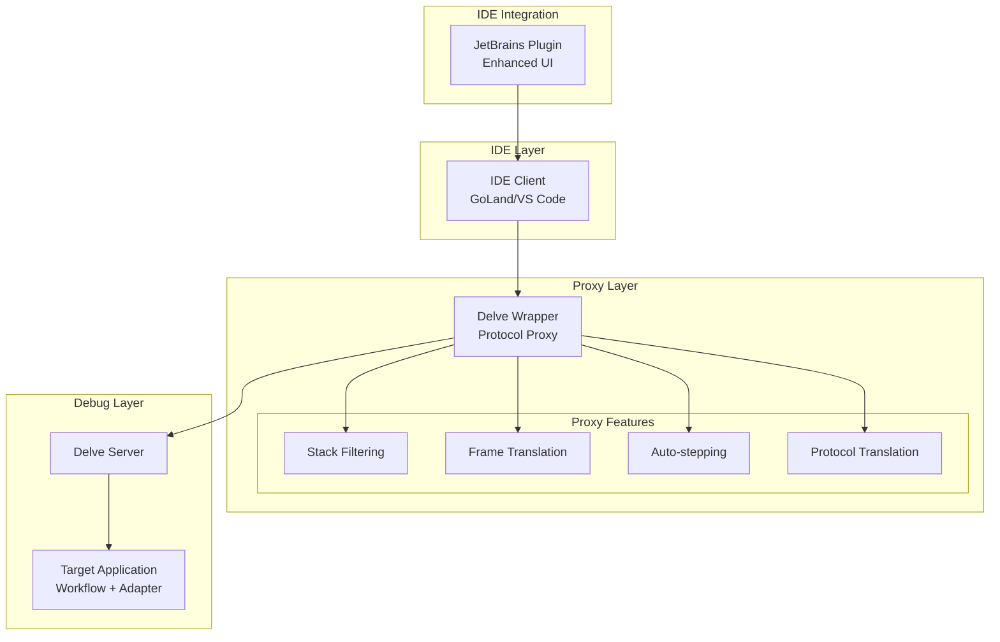
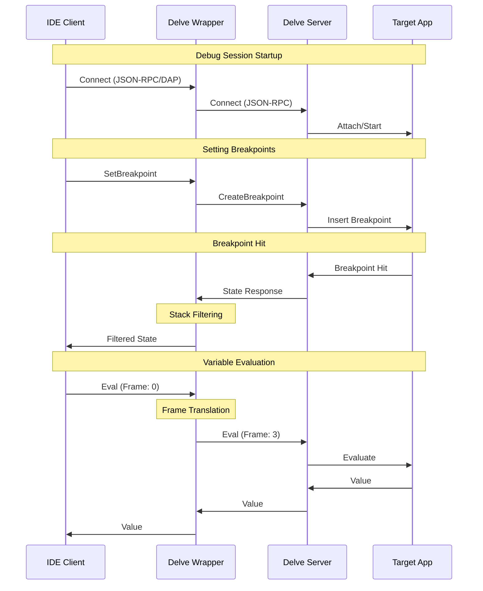
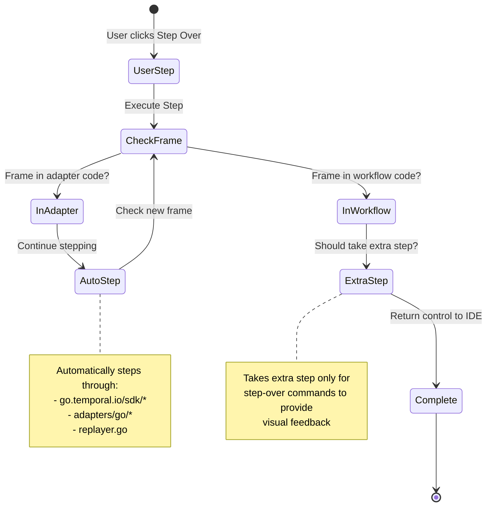

# Architecture Guide

This document provides a high-level overview of the Temporal Workflow Debugger architecture, explaining how the components work together to provide seamless debugging.

## 📋 Table of Contents

- [System Overview](#system-overview)
- [Core Components](#core-components)
- [Protocol Flow](#protocol-flow)
- [Data Flow](#data-flow)
- [Design Decisions](#design-decisions)
- [Extension Points](#extension-points)

## 🏗️ System Overview

The Temporal Workflow Debugger consists of three main components that work together to provide transparent debugging:



## 🧱 Core Components

### 1. Delve Wrapper (Proxy)

**Purpose**: Acts as an intelligent proxy between debugging clients and the Delve debugger.

**Key Responsibilities**:
- **Protocol Translation**: Handles both JSON-RPC (GoLand) and DAP (VS Code) protocols
- **Stack Filtering**: Removes adapter/SDK frames from stack traces
- **Frame Translation**: Maps filtered frame numbers to original Delve frame numbers
- **Auto-stepping**: Automatically steps through non-user code
- **Request/Response Interception**: Monitors and modifies debug protocol messages

**Architecture Pattern**: Transparent Proxy with Side-Channel Processing

### 2. JetBrains Plugin

**Purpose**: Provides enhanced IDE integration for GoLand/IntelliJ IDEA users.

**Key Features**:
- Simplified debug configuration
- Temporal-specific debugging actions
- Enhanced workflow visualization
- Integrated workflow history viewing

**Architecture Pattern**: IDE Plugin Extension

### 3. Replayer Adapter

**Purpose**: Enables debugging of workflow replay scenarios.

**Key Components**:
- Workflow execution interceptors
- Breakpoint integration with workflow history
- State synchronization between debugger and workflow execution

## 🔄 Protocol Flow

### IDE to Delve Communication



### Protocol Translation Modes

| IDE Type | Protocol | Request Format | Response Format |
|----------|----------|----------------|-----------------|
| GoLand | JSON-RPC | `{"method":"RPCServer.Stacktrace","id":1}` | `{"id":1,"result":{"Locations":[]}}` |
| VS Code | DAP | `{"command":"stackTrace","seq":1}` | `{"seq":1,"body":{"stackFrames":[]}}` |

## 📊 Data Flow

### Stack Trace Filtering

```mermaid
flowchart TD
    A[Delve Returns<br/>Full Stack] --> B{Contains<br/>Workflow Code?}
    B -->|Yes| C[Find First<br/>Workflow Frame]
    B -->|No| D[Return Empty<br/>Stack]
    
    C --> E[Create Frame<br/>Mapping]
    E --> F[Filter Frames<br/>From Workflow Down]
    F --> G[Update Frame<br/>Indices]
    G --> H[Return Filtered<br/>Stack to IDE]
    
    subgraph "Original Stack"
        O1[Frame 0: adapter_go.notify]
        O2[Frame 1: adapter_go.outbound]
        O3[Frame 2: temporal.sdk.internal]
        O4[Frame 3: my_workflow.Process]
        O5[Frame 4: runtime.goexit]
    end
    
    subgraph "Filtered Stack"
        F1[Frame 0: my_workflow.Process]
        F2[Frame 1: runtime.goexit]
    end
    
    subgraph "Frame Mapping"
        M1[filtered[0] → original[3]]
        M2[filtered[1] → original[4]]
    end
```

### Auto-stepping Flow



## 🎯 Design Decisions

### 1. Transparent Proxy Architecture

**Decision**: Use a transparent proxy instead of modifying Delve directly.

**Rationale**:
- **Non-invasive**: Works with unmodified Delve and IDEs
- **Protocol Agnostic**: Supports multiple debugging protocols
- **Maintainable**: Easier to update as Delve evolves
- **Testable**: Can be tested independently

**Trade-offs**:
- ✅ Compatibility with multiple IDEs
- ✅ No Delve modifications required
- ❌ Additional network layer introduces latency
- ❌ More complex than direct integration

### 2. Side-Channel Processing

**Decision**: Process protocol messages in parallel with transparent forwarding.

**Rationale**:
- **Protocol Integrity**: Original byte streams remain unmodified
- **Full Interception**: Can analyze all protocol traffic
- **Backwards Compatibility**: Works with any JSON-RPC/DAP client

**Implementation**:
```go
// Transparent forwarding
io.Copy(delveConn, &interceptingReader{...})

// Side-channel processing in Read()
func (r *interceptingReader) Read(p []byte) (n int, err error) {
    n, err = r.reader.Read(p)        // Original bytes pass through
    r.buffer = append(r.buffer, p[:n]...)  // Copy for analysis
    r.parseMessages()                // Parse without modifying stream
    return n, err
}
```

### 3. Frame Mapping Strategy

**Decision**: Create bidirectional frame mapping instead of renumbering frames.

**Rationale**:
- **Accurate Variable Evaluation**: Maintains correct frame context
- **IDE Compatibility**: IDEs see consistent frame numbering
- **Delve Compatibility**: Delve receives correct original frame numbers

**Frame Translation Process**:
1. **During Stack Filtering**: Create mapping `filtered_index → original_index`
2. **During Requests**: Translate filtered frame numbers to original frame numbers
3. **During Responses**: Return results without modification

### 4. Multi-Protocol Support

**Decision**: Support both JSON-RPC and DAP in the same proxy.

**Rationale**:
- **Wide IDE Support**: GoLand (JSON-RPC) and VS Code (DAP)
- **Single Codebase**: Unified implementation for all clients
- **Future Extensibility**: Easy to add more protocols

**Protocol Detection**:
```go
// Detect protocol by content
if isContentLengthHeader(data) {
    return handleDAP(data)
} else {
    return handleJSONRPC(data)
}
```

## 🔌 Extension Points

### Adding New IDEs

To support a new IDE:

1. **Identify Protocol**: Determine if it uses JSON-RPC, DAP, or custom protocol
2. **Add Protocol Handler**: Implement protocol-specific parsing if needed
3. **Test Integration**: Verify stack filtering and variable evaluation work
4. **Update Documentation**: Add IDE-specific setup instructions

### Custom Filtering Rules

The stack filtering system can be extended:

```go
// Extend isInAdapterCodeByPath()
func isInAdapterCodeByPath(filePath string) bool {
    return strings.Contains(filePath, "go.temporal.io/sdk/") ||
           strings.Contains(filePath, "adapters/go/") ||
           strings.Contains(filePath, "your-custom-adapter/")  // Add custom rules
}
```

### Additional Auto-stepping Logic

Auto-stepping can be customized for different scenarios:

```go
// Extend shouldContinueAutoStepping()
func shouldContinueAutoStepping(location Location) bool {
    // Add custom logic for specific files or functions
    return isInAdapterCodeByPath(location.File) ||
           isInTemporalSDK(location.File) ||
           isInCustomInternalCode(location.File)
}
```

## 🔄 Future Architecture Considerations

### Scalability
- **Multiple Workflow Support**: Debugging multiple workflows simultaneously
- **Distributed Debugging**: Cross-service workflow debugging
- **Performance Optimization**: Reducing proxy overhead

### Enhanced Features
- **Visual Workflow State**: Real-time workflow state visualization
- **History Integration**: Seamless integration with workflow history
- **Advanced Filtering**: User-configurable filtering rules

### Platform Support
- **Language Extensions**: Support for other Temporal SDKs (Java, TypeScript)
- **Cloud Integration**: Integration with Temporal Cloud debugging tools
- **Container Support**: Enhanced debugging in containerized environments

## 🔗 Related Documents

- **[Developer Guide](./developer-guide.md)** - Implementation details and contribution guidelines
- **[User Guide](./user-guide.md)** - End-user setup and usage
- **[Troubleshooting](./troubleshooting.md)** - Common issues and solutions 