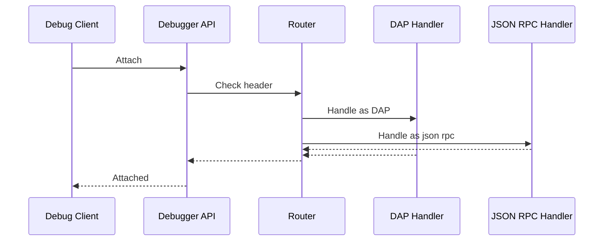

# Architecture

## Overview

The plugin consists of an IDE Debugging UI, service layer, and `tdlv` integration for debugging Temporal workflows.

## Components

- IDE Debugging UI: Panel for history upload and set breakpoints.
- IDE Debugging Service: provide api for the Debugger to retrieve the uploaded history & breakpoints.
- Debugger (`tdlv`): Communicates with language debugger (think Delve, Js-Debug, Debugpy) to intercept debugging event, if a breakpoint is hit, the Debugger notifies the IDE Debugging Service to highlight the event that has its breakpoint hit.
- Adapter: Adapter places sentinel breakpoints inside Temporal workflow/activity interceptors.


## 🏛 Architecture Overview

```
┌─────────────────┐    ┌──────────────────┐    ┌─────────────────┐
│   IDE Plugin    │    │   Serving Layer  │    │ Debugger Server │
│                 │◄──►│   (tdlv)         │◄──►│   + Workflow    │
│                 │    │                  │    │   Replayer      │
└─────────────────┘    └──────────────────┘    └─────────────────┘
        │                       │                       │
        │              ┌────────▼────────┐              │
        │              │IDE Plugin Server│              │
        │              │ (Breakpoints +  │              │
        └─────────────►│  History)       │◄─────────────┘
                       └─────────────────┘
```

The debugger consists of several integrated components:

1. **JetBrains Plugin**: Provides the user interface, manages workflow history, and integrates with IDE debugging
2. **Serving layer (`tdlv`)**: Intercepts debugging commands and enhances them with workflow-specific logic
3. **Workflow Replayer**: Executes workflow code deterministically using Temporal's replayer
4. **History Server**: Manages workflow event history and breakpoint state
5. **Adapter Layer**: Connects the replay execution with the debugging infrastructure


## Flow

1. User upload history JSON.
2. User set event breakpoints.
3. User start debugging session.
4. Plugin launches `tdlv` process.

## Design
Some notable design decisions are:
- Place sentinel breakpoints in workflow & activity interceptors

- Intercept DAP stream to hide workflow & adapter code

- For go delve-json rpc integration (used in Goland), re-use some of the logic in Delve to differentiate JSON-RPC and DAP based on the first byte.


