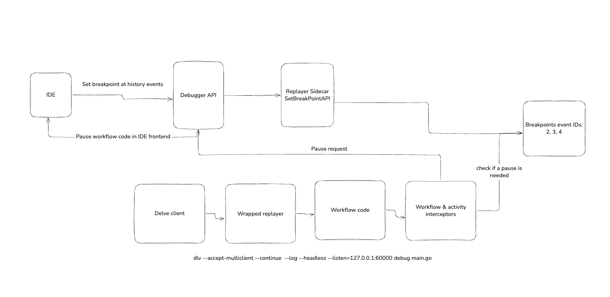

# User Guide: Temporal Workflow Debugger

This guide walks you through setting up and using the Temporal Workflow Debugger to debug your Go workflows seamlessly.

## 📋 Table of Contents

- [Overview](#overview)
- [Prerequisites](#prerequisites)
- [Installation](#installation)
- [Quick Start](#quick-start)
- [IDE Setup](#ide-setup)
- [Debugging Your Workflows](#debugging-your-workflows)
- [Features](#features)
- [Best Practices](#best-practices)
- [Common Issues](#common-issues)

## 🎯 Overview

The Temporal Workflow Debugger provides transparent debugging for Temporal Go workflows with:

- **Seamless IDE integration** - Works with GoLand/IntelliJ IDEA and VS Code
- **Stack trace filtering** - Hides internal adapter code, shows only your workflow logic
- **Variable inspection** - Examine workflow variables, local vars, and function arguments
- **Auto-stepping** - Automatically skips through SDK internal code
- **Multi-protocol support** - JSON-RPC (GoLand) and DAP (VS Code)



## 🔧 Prerequisites

Before starting, ensure you have:

- **Go 1.19+** installed
- **[Delve debugger](https://github.com/go-delve/delve)** installed:
  ```bash
  go install github.com/go-delve/delve/cmd/dlv@latest
  ```
- One of the supported IDEs:
  - **GoLand/IntelliJ IDEA** with Go plugin
  - **VS Code** with Go extension
- A **Temporal workflow project** to debug

## 📥 Installation

### 1. Clone the Repository

```bash
git clone https://github.com/temporalio/temporal-goland-plugin.git
cd temporal-goland-plugin
```

### 2. Build the Delve Wrapper

```bash
cd delve_wrapper
go build -o delve-wrapper .
```

### 3. Install JetBrains Plugin (Optional)

For enhanced GoLand/IntelliJ IDEA integration:

```bash
cd jetbrains-plugin
./gradlew buildPlugin
```

Install the generated plugin from `build/distributions/` through your IDE's plugin manager.

## 🚀 Quick Start

### Step 1: Start the Delve Wrapper

The delve wrapper acts as a proxy between your IDE and Delve:

```bash
cd delve_wrapper
./delve-wrapper
```

You should see:
```
2025/01/15 10:30:45 Delve proxy listening on :2345
2025/01/15 10:30:45 Ready to accept connections...
```

### Step 2: Start Your Workflow with Delve

In your workflow project directory:

```bash
dlv --accept-multiclient --continue --log --headless --listen=127.0.0.1:60000 debug main.go
```

### Step 3: Connect Your IDE

Configure your IDE to connect to the proxy (see [IDE Setup](#ide-setup) for details).

### Step 4: Debug

1. Set breakpoints in your workflow code
2. Start your debugging session
3. Step through your workflow logic

## 🔧 IDE Setup

### GoLand/IntelliJ IDEA

#### Using the Plugin (Recommended)

1. Install the Temporal Workflow Debugger plugin
2. The plugin automatically configures debug settings
3. Use **Run → Debug 'Temporal Workflow'**

#### Manual Configuration

1. Go to **Run → Edit Configurations**
2. Click **+** → **Go Remote**
3. Configure:
   - **Name**: "Temporal Workflow Debug"
   - **Host**: `127.0.0.1`
   - **Port**: `2345`

### VS Code

1. Install the **Go extension**
2. Create `.vscode/launch.json`:

```json
{
    "version": "0.2.0",
    "configurations": [
        {
            "name": "Temporal Workflow Debug",
            "type": "go",
            "request": "attach",
            "mode": "remote",
            "remotePath": "${workspaceFolder}",
            "port": 2345,
            "host": "127.0.0.1"
        }
    ]
}
```

3. Press **F5** or use **Run → Start Debugging**

## 🐛 Debugging Your Workflows

### Setting Effective Breakpoints

#### ✅ Good Breakpoint Locations

```go
func OrderProcessingWorkflow(ctx workflow.Context, order Order) error {
    // ✅ Excellent - Start of workflow
    logger := workflow.GetLogger(ctx)
    logger.Info("Processing order", "orderID", order.ID)
    
    // ✅ Good - Before important logic
    if order.Amount <= 0 {
        return errors.New("invalid order amount")
    }
    
    // ✅ Good - Before activity execution
    var paymentResult PaymentResult
    err := workflow.ExecuteActivity(ctx, ProcessPayment, order).Get(ctx, &paymentResult)
    if err != nil {
        // ✅ Good - Error handling
        return fmt.Errorf("payment failed: %w", err)
    }
    
    return nil
}
```

#### ❌ Avoid Breakpoints In

- Temporal SDK code (`go.temporal.io/sdk/...`)
- Adapter/proxy code (`adapters/go/...`, `delve_wrapper/...`)
- Deep runtime functions
- Generated code

### Debugging Operations

#### Variable Inspection

- **Hover** over variables to see values
- **Watch expressions** for monitoring workflow state
- **Local variables panel** shows current scope
- **Function arguments** are visible in stack frames

#### Stepping Through Code

- **Continue (F9)**: Resume until next breakpoint
- **Step Over (F8)**: Execute current line, skip function internals
- **Step Into (F7)**: Enter function calls
- **Step Out (Shift+F8)**: Exit current function

The debugger automatically skips through SDK internal code, returning control when it reaches your workflow logic.

#### Stack Navigation

The debugger filters stack frames to show only relevant code:

```
✅ What you see:
Frame 0: OrderProcessingWorkflow    ← Your workflow
Frame 1: runtime.goexit             ← Runtime

❌ What's hidden:
Frame 0: adapter_go.notifyRunner     ← Internal adapter
Frame 1: adapter_go.outbound         ← Internal adapter  
Frame 2: temporal.sdk.internal       ← SDK internals
Frame 3: OrderProcessingWorkflow     ← Your code (shown as Frame 0)
```

## ✨ Features

### Automatic Stack Filtering

- Hides Temporal SDK and adapter implementation details
- Shows only your workflow code and relevant runtime frames
- Maintains proper frame numbering for variable evaluation

### Smart Auto-Stepping

- Automatically steps through adapter/SDK code
- Returns control when reaching your workflow logic
- Preserves debugging context and state

### Variable Evaluation

- Works correctly with filtered stack frames
- Supports complex expressions and nested objects
- Maintains accurate frame context

### Multi-IDE Support

- **JSON-RPC** protocol for GoLand/IntelliJ IDEA
- **DAP (Debug Adapter Protocol)** for VS Code
- Transparent protocol translation

## 💡 Best Practices

### Workflow Code Organization

```go
// ✅ Organize code for debugging clarity
func OrderWorkflow(ctx workflow.Context, order Order) error {
    // Clear workflow phases
    if err := validateOrder(ctx, order); err != nil {
        return err
    }
    
    if err := processPayment(ctx, order); err != nil {
        return err
    }
    
    if err := fulfillOrder(ctx, order); err != nil {
        return err
    }
    
    return nil
}

// ✅ Separate functions for each workflow step
func validateOrder(ctx workflow.Context, order Order) error {
    // Validation logic with breakpoints
    return nil
}
```

### Debugging Strategy

1. **Start with workflow entry points** - Set initial breakpoints at workflow start
2. **Use step-over liberally** - Step through workflow logic without diving into activities
3. **Check error paths** - Set breakpoints in error handling code
4. **Monitor workflow context** - Watch important workflow state variables
5. **Use logging alongside debugging** - Combine debugging with workflow.GetLogger()

### Performance Tips

- **Close unused debug sessions** - Terminate sessions when done
- **Limit concurrent debugging** - Avoid multiple simultaneous debug sessions
- **Use breakpoints strategically** - Don't over-breakpoint complex workflows

## ❗ Common Issues

### Connection Problems

**Problem**: IDE can't connect to debugger

**Solutions**:
1. Verify delve wrapper is running: `./delve-wrapper`
2. Check correct ports: Proxy (2345), Delve (60000)
3. Ensure no firewall blocking connections
4. Verify Delve is listening: `dlv --listen=127.0.0.1:60000`

### Breakpoints Not Working

**Problem**: Breakpoints aren't being hit

**Solutions**:
1. Ensure breakpoints are in your workflow code, not SDK code
2. Verify workflow is actually executing (check Temporal Web UI)
3. Check workflow registration and worker startup
4. Add logging to confirm code paths

### Variables Show "Undefined"

**Problem**: Variable evaluation fails

**Solutions**:
1. Ensure you're in the correct stack frame
2. Try simpler expressions first
3. Check variable scope (local vs workflow context)
4. Verify frame filtering is working

See the [Troubleshooting Guide](./troubleshooting.md) for detailed solutions.

## 🔗 Next Steps

- **[Architecture Guide](./architecture.md)** - Understand how the debugger works
- **[Developer Guide](./developer-guide.md)** - Contribute or customize the debugger
- **[Troubleshooting Guide](./troubleshooting.md)** - Detailed problem resolution

## 📞 Support

Need help? Check these resources:

1. **[Troubleshooting Guide](./troubleshooting.md)** - Common solutions
2. **[GitHub Issues](https://github.com/temporalio/temporal-goland-plugin/issues)** - Report bugs
3. **[Temporal Community](https://community.temporal.io/)** - General Temporal questions
4. **[Documentation](./README.md)** - Full documentation index 